# Grokmax Website

<p align="center">
  <picture>
    <source media="(prefers-reduced-motion: reduce)" srcset="assets/hero/hero-reduced.svg">
    <source media="(prefers-color-scheme: light)" srcset="assets/hero/hero-light.svg">
    
  </picture>
</p>

<p align="center">
  <picture>
    <source media="(prefers-reduced-motion: reduce)" srcset="assets/hero/computational-dark.svg">
    <source media="(prefers-color-scheme: light)" srcset="assets/hero/computational-light.svg">
    
  </picture>
</p>

**STATUS: ACTIVE**

GrokMax marketing site — deterministic-first routing to scale down GrokBot usage. Static Next.js export, deployed to grokmax.noaerth.com.

## Why it exists

This repository exists as working code rather than as a proposal. What follows is what it contains.

## What is in it

| | |
| --- | --- |
| Source files | 14 |
| Test files | 0 |
| Documentation files | 0 |
| CI workflows | 0 |
| Build manifest | package.json |

Observed: 14 source file(s); build via `package.json`.

## Build and run

```bash
pnpm install
pnpm build
pnpm test
```

## Evidence

Counts above are counted from the repository tree, not asserted. Where a value could not be measured it is omitted rather than estimated.

---

Part of the DUNG30N5 × NOAERTH portfolio. Repository: [`M4G3LL4N0/grokmax-website`](https://github.com/M4G3LL4N0/grokmax-website).
